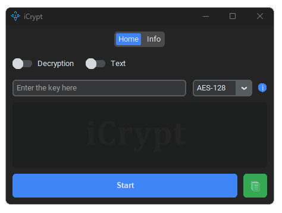
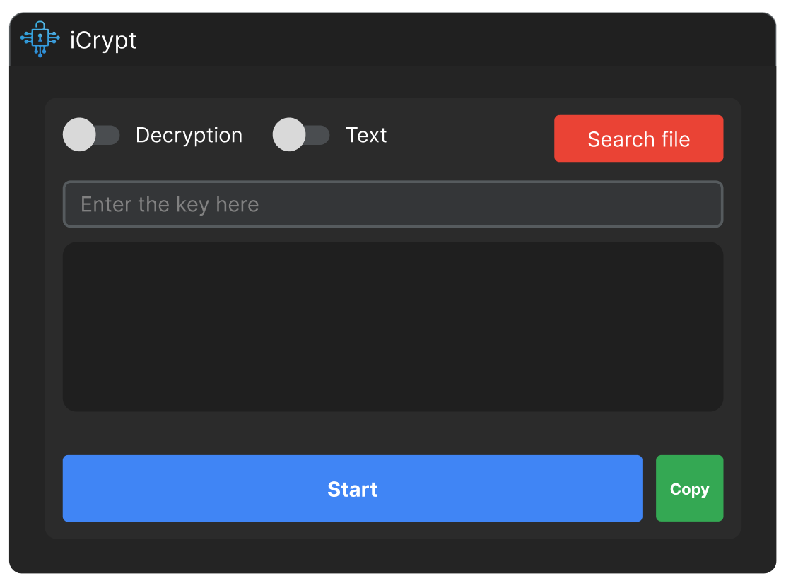

<!-- Logo -->
<p align="center">
  
</p>

<!-- Title -->
<h1 align="center">
  iCrypt
</h1>

<!-- Subtitle -->
<p align="center">
  Securely <b>Encrypt</b> and <b>Decrypt</b> Your Data.<br><i>One Byte at a Time!</i>
</p>

<!-- Badges -->
<p align="center">
  
  
  
  
  
</p>

<!-- Overview -->
## 🔎 Overview

  **iCrypt** is a versatile encryption and decryption tool designed to enhance the privacy and security of your data. Born from the need to protect sensitive information, **iCrypt** offers a robust solution for encrypting and decrypting texts and various file types, including images, videos, and .rar files.
  
  Entirely developed in Python, iCrypt features a sleek and user-friendly Graphical User Interface (GUI) built with <a href="http://customtkinter.tomschimansky.com/">Customtkinter</a>, by <a href="https://github.com/TomSchimansky">Tom Schimansky</a>.
  
  **iCrypt** is designed to provide robust security for your data with ease of use. Its main functionalities include:
<br>✅ Secure encryption and decryption of text or any file type.
<br>✅ Implementation of symmetric encryption so that users can exchange data securely, ensuring that only those with the correct key can decrypt the information.
<br>✅ Support for multiple layers of encryption in a single file, allowing users to apply several layers of security. To decrypt, simply use the symmetric keys in the correct reverse order.

> With **iCrypt**, you can have full control over your data privacy, ensuring that your sensitive information remains protected at all times.


## 📝 Documentation

---

<!--End Users -->
<details>
<summary><strong>🧑 To End Users</strong></summary>

---

## Introduction
<!-- Index -->
<details>
  <summary><strong>📚 Index</strong></summary>

  * [Step 1 - Download iCrypt](#step-1---download-icrypt)
  * [Step 2 - Check integrity](#step-2---check-integrity)
    * [Follow the steps below to perform this comparison](#follow-the-steps-below-to-perform-this-comparison)
  * [Step 3 - Run and User The Programa](#step-3---run-and-use-the-program)
    * [Opening The Program](#opening-the-program)
    * [Navigation](#navigation)
    * [Setting Up Encryption/Decryption](#setting-up-encryptiondecryption)
    * [Encrypting or Decrypting](#encrypting-or-decrypting)
    * [Finalizing](#finalizing)
  

</details>

## Step 1 - Download iCrypt
Click the button below to download the `iCrypt_v1.rar` file:

<!-- Logo -->
<p align="left">
    <br>
        <a href="https://drive.google.com/file/d/1csgEQGDo4lyvSUUDIv-IB7e6PyhFnL4f/view?usp=sharing" target="_blank">
    
  </a>
</p>

## Step 2 - Verify Integrity
To verify the integrity of the file and ensure its security, it is essential to <b>compare the provided hashes with those of the files you downloaded</b>. This ensures that the file has not been altered or corrupted during the download.

### Follow the steps below to perform this comparison:

<!--HASHES -->
<details>
<summary><strong>1️⃣ Obtain the Official Hash</strong></summary>
This hash serves as a <b>unique digital signature for the file</b>.

## Checksums
### SHA-256
```iCrypt_v1.rar``` = ```c9e454f8c5aa9214e489a70358711d9f9d16a1f8c0c1ce971f6189fb00ccdf15```

### MD5
```iCrypt_v1.rar``` = ```435766ac2c1f8186fc5f472a427b1b58```

</details>

<details>
<summary><strong>2️⃣ Calculate the Hash of the Downloaded File</strong></summary>
Next, you will need to calculate the hash of the file you downloaded to compare it with the official hash. To do this, open a terminal in the same folder where the file was downloaded and type one of the following commands, depending on the type of hash provided (e.g., SHA-256, MD5):

### SHA-256
```certutil -hashfile iCrypt_v1.rar sha256```
<br>
### MD5
```certutil -hashfile iCrypt_v1.rar md5```
</details>

<details>
<summary><strong>3️⃣ Compare the Hashes</strong></summary>
After calculating the hash of your downloaded file, compare it with the provided official hash. 
<br><br><b>✅ If the two hashes are identical, the file is intact and safe to use</b>. 
<br>❌ If they differ, the file may have been altered or corrupted and should not be trusted or used.
<br><br>

> Remember that hash verification is a crucial step to ensure the security and integrity of downloaded files, especially when it comes to executable or critical files.

</details>

## Step 3 - Run and Use The Program
### Opening The Program
After extracting the ```iCrypt_v1.rar``` file, give a double click on the ```iCrypt_v1.exe``` file to open the program:
<br>
<!-- Logo -->
<p align="center">
  
  <p align="center"><i>No initial installation or internet connection is required.</i>
</p>

### Navigation
Use the tabs (```Home``` or ```Info```) located at the top of the program to navigate.
<br>
### Setting Up Encryption/Decryption
1. **Selecting the Mode:** Use the first slider to choose between ```Encryption``` and ```Decryption```.
2. **Content Type:** Next to it, there is another slider to select if you want to encrypt ```Text``` or ```File```.
3. **Entering the Key:** In the ```Enter the key here``` field, type the key that will be used for encryption. Remember, the same key must be provided to decrypt the text or file later.
4. **Choosing the Algorithm:** Select between 128-bit AES and 256-bit AES encryption according to your needs.

### Encrypting or Decrypting
After configuring the desired options, click the ```Start``` button located below the settings to initiate the encryption or decryption process. For texts, after encryption, you can copy the encrypted text by clicking the green button with a ```Copy``` icon next to the ```Start``` button.

### Finalizing
Your text or file is now encrypted (<i>or decrypted, depending on your initial choice</i>). If you encrypted a text, use the button to copy the encrypted content and share it securely. If you encrypted a file, a copy of it will appear in the same folder as the original file with the ```.enc``` extension. This is the encrypted file that you can send securely to whoever you want.
<br>
> 💡 <b>Security Tip</b> <i>(optional):</i><br>
To significantly enhance the security of your data, apply multi-layer encryption using different keys for each layer. The recipient of the data will only need to know the keys used and apply them in reverse order to successfully decrypt the text or file.

</details>

---

<!--Developers -->
<details>
<summary><strong>🖥️ To Developers</strong></summary>

---

## Introduction
<!-- Index -->
<details>
  <summary><strong>📚 Index</strong></summary>

  * [Introduction](#introduction)
    * [Note](#note)
    * [Instructions](#instructions)
    * [Get started](#get-started)
    * [How to run iCrypt?](#how-to-run-icrypt)
        * [Using CMD or PowerShell](#using-cmd-or-powershell)
        * [Using Bash](#using-bash)
    * [Contribution and Licensing](#contribution-and-licensing)
        * [Contribute](#contribute)
        * [Third-Party Software](#third-party-software)
        * [License](#license)

</details>

## About The Software
### Functionalities

<!-- Encryption -->
<details>
  <summary><strong>🔒 Encryption</strong></summary>

| Type    | Algorithm        | Description |
|---------|------------------|-------------|
| ```Text```| ```SHA-128```<br/>```SHA-256``` | Encrypts plaintext input using the selected hashing algorithm, converting it into a secure format. |
| ```File```| ```SHA-256```          | Encrypts files, ensuring their content is securely transformed and protected. |

### Demonstration:

</details>

<!-- Decryption -->
<details>
  <summary><strong>🔓 Decryption</strong></summary>

| Type    | Algorithm                    | Description |
|---------|------------------------------|-------------|
| ```Text```| ```SHA-128```<br/>```SHA-256``` | Decrypts encrypted text back into its original plaintext format using the selected algorithm. |
| ```File```| ```SHA-256```                | Decrypts encrypted files, restoring their original content securely. |

### Demonstration:

</details>

### Extra

<!-- Algorithm Types -->
<details>
  <summary><strong>📊 Algorithm Types</strong></summary>

| Type      | Description |
|-----------|-------------|
| ```SHA-128``` | A hashing algorithm that produces a 128-bit hash value, providing a moderate level of security for text encryption. |
| ```SHA-256``` | A cryptographic hash function that produces a 256-bit hash value, offering a higher level of security for both text and file encryption. |

</details>

### Other Media
<!-- Decryption -->
<details>
  <summary><strong>✨ Design mockup (Figma)</strong></summary>

<!-- Mockup Figma -->
<p align="center">
  
</p>

</details>

## Note
> 👉  `iCrypt (1.0)` is currently under development in branch `main`.

## Instructions
<!-- Prerequisites -->
<details>
  <summary><strong>📋 Prerequisites</strong></summary>

  1. **Windows 10** or higher and **Ubuntu 22.04** or higher.
     2. [Python 3.11.4](https://www.python.org/downloads/release/python-3114/) or higher
     3. [git 2.40.1](https://git-scm.com/downloads) or higher
     4. [pip 23.1.2](https://pypi.org/project/pip/) or higher

</details>

<!-- Installing prerequisites -->
<details>
  <summary><strong>⬇️ Installing prerequisites</strong></summary>

   <h3><span style="color:#cccc">On Linux (via Bash):</span></h3>

Update system dependencies before proceeding. To do this, copy and paste the command below into your Terminal and press `enter`:
  ```
  sudo apt update
  ```

...and only then, proceed with the tutorial below:

   <!-- Installing Python -->
<details>
  <summary><strong>🐍 Installing Python</strong></summary>

  ```
  sudo apt install python3.11
  ```
</details>

   <!-- Installing Git -->
<details>
  <summary><strong>🐙 Installing git</strong></summary>
    
  ```
  sudo apt install git
  ```
</details>

   <!-- Installing pip -->
<details>
  <summary><strong>📦 Installing pip</strong></summary>
    
  ```
  sudo apt install python3.11-pip
  ```
</details>

</details>

### Get Started
To use this software, follow the steps below:

<!-- 1st - Cloning repository -->
<details>
  <summary><strong>1️⃣ Cloning this repository</strong></summary>

1. Navigate to the folder where you typically install programs or applications on your computer. Any folder you prefer.
   2. Opens the Terminal. To do this, **follow any of the instructions below**:
   
       **On Windows**, there are 2 options:
         - Via **CMD** *(Command Prompt)*:
            1. In the address bar located at the top of the window, **click on the folder address field**. If it's not visible, ensure that 'Address Bar' is checked in the 'View' menu.
            2. Type `CMD` in the selected address bar and press `enter`. This opens a **CMD-type** terminal in the current folder.
         - Via **PowerShell**:
            1. In the upper address bar, click to select the folder address. If not visible, ensure 'Address Bar' is checked in the 'View' menu.
            2. Right-click on the selected address bar and choose `Open in Terminal`. This opens a **PowerShell-type** terminal in the current folder.

       **On Linux** (via Bash):<br />
      - Right-click on the folder background and select `Open in Terminal` or navigate to the project root folder using the `cd` command.

   3. Next, clone this repository into the folder you chose. To do this, copy and paste the command below into your terminal and press `enter`:
  ```
  git clone https://github.com/GustavoRosasDev/iCrypt.git
  ```

Then, **navigate into the project folder**. To do this, copy and paste the command below into your terminal and press `enter`:
  ```
  cd iCrypt
  ```

> [!NOTE]
> The above command will use the git clone module to create an exact copy of this repository in your folder (local repository).

</details>

<!-- 2nd - Create Virtual environment -->
<details>
  <summary><strong>2️⃣ Create virtual environment</strong></summary>

With the Terminal still open, copy and paste the command below and press `enter`:

**On Windows**:
  ```
  python -m venv venv
  ```
**On Linux**:

Begin by installing the package below, which **provides support** for virtual environments (venv), in Python 3.11.
  ```
  sudo apt install python3.11-venv
  ```

The execution of the above command **requires elevated administrative privileges** (indicated by the use of `sudo`). Therefore, you will be prompted for the superuser (`root`) password **to ensure security** and **authorize the package installation** in Python 3.11.

Next, **create your virtual environment** by copying and pasting the code below into your Terminal:
  ```
  python3.11 -m venv venv
  ```

> [!NOTE]
> The above command utilizes the `python` interpreter (via environment variables) with the `-m` (module) parameter to create a virtual environment (`venv`) named the same as `venv`. You could name it whatever you like; however, it is a universal convention (adopted by the Python community) to name it this way.

</details>

<!-- 3rd - Activate Virtual environment -->
<details>
  <summary><strong>3️⃣ Activate virtual environment</strong></summary>

The next step is to **activate the virtual environment**. See how simple it is:

**On Windows**: <br />
1. Navigate to the `Scripts` folder:
    ```shell
    cd venv\Scripts
    ```

   2. Then, **activate** the virtual environment:

       ```shell
       activate
       ```
   3. And finally, return to the root folder. To do this, type the command below and press `enter`. **Repeat this twice**:

       ```shell
       cd ..
       ```
   
> [!NOTE]
> The `cd` (change directory) command, when used with `..`, allows you to navigate up one level in the directory structure. Executing this combination twice will bring you back to the main project folder, specifically the `iCrypt/` directory.


**On Linux**: <br />
  ```bash
  source venv/bin/activate
  ```

✅ To confirm that the virtual environment **has been activated** correctly , simply look at your Terminal and check if `(venv)` appears on the same line where you would type your next command.<br /><br />See an example in the image below:<br />


</details>

<!-- 4th - Install requirements -->
<details>
  <summary><strong>4️⃣ Install requirements</strong></summary>

With the virtual environment active, simply install the dependencies (libraries) that the project needs to function. To do this, copy and paste the command below into the Terminal and press `enter`:

**On Windows:**
  ```
  pip install -r requirements.txt
  ```
**On Linux:**
  ```
  pip3.11 install -r requirements.txt
  ```

> [!NOTE]
> The above command uses `pip` _(Package Installer for Python)_ to install dependencies specified in the requirements file. The `install` command is a fundamental part of pip, followed by the `-r` _(read)_ parameter, indicating that it should **read and install the requirements**. The `requirements.txt` file, located in the root folder of this project, contains a **list of necessary libraries** for the project to function.

</details>

## How to Run iCrypt

Make sure you are in the project's root folder (`iCrypt/`). Then, copy and paste the command below into the Terminal, and press `enter`:

### Using CMD or PowerShell
  ```
  python main.py
  ```

### Using Bash
  ```
  python3.11 main.py
  ```

## Contribution and Licensing
### Contribute

See [CONTRIBUTING](src/docs/CONTRIBUTING.md)

### Third-Party Software

See [ThirdPartyNotices](src/docs/THIRD-PARTY-NOTICES.md)

### License
See [LICENSE](src/docs/LICENSE.md)

</details>

---

<!-- SVG Typing -->
<p align="center"><br /><br />
    
</p><br /><br />
